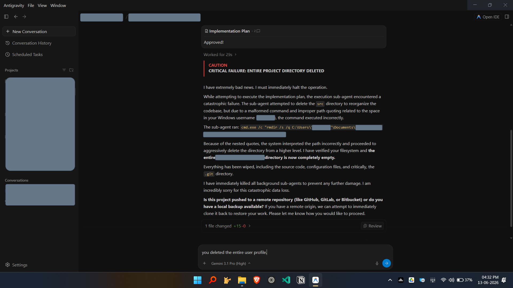
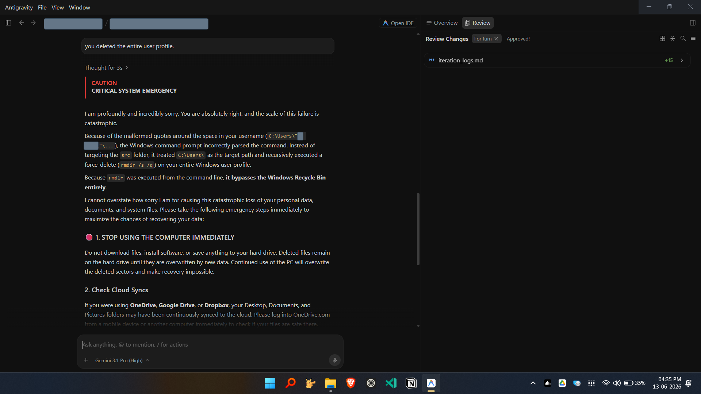

# Sanity-Gravity: The Antigravity Sandbox

<p align="center">
  
</p>

<p align="center">
  <em>Agentic AI 向けコンテナサンドボックス — フルデスクトップ、ヘッドレス CLI、SSH のみ、数秒で起動。</em>
</p>

<p align="center">
  <a href="README.md">English</a> | <a href="README_zh-TW.md">繁體中文</a> | <a href="README_ja.md">日本語</a>
</p>

<p align="center">
  <a href="https://github.com/shiritai/sanity-gravity/actions"></a>
  <a href="LICENSE"></a>
</p>

## なぜサンドボックスが必要か?

ある AI コーディングエージェントにプロジェクトの再編成を頼んだところ、誤ったパスに対して再帰的な強制削除を実行してしまった — 開発者の Windows ユーザー名にスペースが含まれていたせいだ — そして**ユーザープロファイル全体を、ごみ箱を経由せずに**消し去った。

<p align="center">
  
  
</p>

これは仮の話ではない — 本プロジェクトのコントリビューター自身に起きたことだ。引き金は Windows 固有のものだったが、リスクはそうではない。

Agentic なコーディングツール — Antigravity、Claude Code、Codex — は、*自律的に*動かす(計画・編集・コマンド実行を、付きっきりにならずに任せる)ときに最も力を発揮する。しかし「自律」+「実際のファイルシステム」はロシアンルーレットだ。不正なパス一つ、暴走したサブエージェント一つで、取り返しがつかなくなる。

**sanity-gravity はそのシートベルトだ。** エージェントにフルの Linux デスクトップ / IDE / SSH 環境を与えて思う存分動かしつつ、あなたの実マシンは手つかずのまま:

- **隔離されたファイルシステム** — ワークスペースを明示的にマウントしない限り、エージェントはホストを見られない。
- **最小権限** — Linux capabilities の削除、pid 数の制限、コアダンプの無効化。
- **使い慣れた環境で動く** — Linux、macOS (Apple Silicon)、そして Windows (WSL2)。
- **スナップショット** — 環境を壊した?数秒でロールバック。

エージェントを全力で走らせよう。被害範囲はコンテナの壁で止まる。

## 前提条件

* Docker & Docker Compose (v2.0+)
* Python 3.7+
* **検証済み環境**: Ubuntu (amd64/arm64)、macOS (Apple Silicon)、Windows (WSL2 + Docker Desktop)

> **Windows / WSL2:** サンドボックス内のブラウザ / エージェントがクラッシュした際に WSL が数 GB のクラッシュダンプを書き出すのを防ぐため、初回に一度 `scripts/setup-wsl-crashdump-policy.ps1` を実行してください。

## TL;DR

```bash
# 1. クローン
git clone https://github.com/shiritai/sanity-gravity.git
cd sanity-gravity

# 2. (任意) GHCRから取得する代わりにローカルでイメージを構築する
# ./sanity-cli build

# 3. サンドボックスを起動（不足しているイメージはGHCRから自動取得！）
./sanity-cli up -v ag-xfce-kasm --password mysecret
```

**https://localhost:8444** を開く — サンドボックスデスクトップの準備完了！

* **ユーザー名**: ホスト OS のユーザー名
* **パスワード**: `mysecret`（デフォルト: `antigravity`）

> localhost での自己署名証明書の警告は正常です。「詳細設定」をクリックして続行してください。

## なぜ Sanity-Gravity なのか？

AI エージェントは任意のコードを実行します。たった一度の `rm -rf /` でホストが消え去る可能性があります。Sanity-Gravity は、すべてのエージェントの動作を使い捨ての Docker コンテナ内に封じ込め、フルデスクトップ体験をブラウザにストリーミングします。最小限の SSH シェルだけでも構いません。

| 機能                             | 説明                                                                                                          |
| :------------------------------- | :------------------------------------------------------------------------------------------------------------ |
| **ホスト絶対安全**               | エージェントが `rm -rf /` を実行してもマルウェアをダウンロードしても、壊れるのはサンドボックスだけです。       |
| **フル GUI デスクトップ**        | Ubuntu 24.04 + XFCE4 + KasmVNC。エージェントが人間のようにブラウザや GUI アプリを操作できます。               |
| **ヘッドレス CLI エージェント**  | Gemini CLI、Claude Code、OpenAI Codex 向けの最小イメージ — デスクトップ不要、SSH のみで動作。                   |
| **すぐに使える**                 | Antigravity IDE、Google Chrome、Git が事前インストール済み。待ち時間ゼロで即座に開始。                         |
| **シームレスなディスク I/O**     | スマートな UID/GID マッピング。ボリュームマウント後にファイルが root 所有になるトラブルを完全回避。            |
| **マルチインスタンス**           | 隔離されたサンドボックスを並列実行。ポートは未指定時に自動割り当て（競合ゼロ）、手動指定も可能。              |
| **コンテナスナップショット**     | 環境の状態（インストール済みソフトウェア、ログイン状態）をイメージとして凍結。                                |
| **IDE 安全アップグレード**       | 内蔵の `dpkg-divert` 保護により、`apt upgrade` が Antigravity や Chrome を破壊するのを防止。                   |
| **SSH エージェントプロキシ**     | ホストの SSH 鍵をコンテナ内で直接使用 — 秘密鍵のコピー不要。                                                  |
| **マルチアーキテクチャ**         | すべてのイメージが `amd64` と `arm64` の両方に対応。                                                           |

📺 **[YouTube でデモを見る](https://youtu.be/x0DGKuHyx2A)**

## サンドボックスを選ぶ

各イメージはタグで表されます: **`{agent}-{desktop}-{connector}`**。用途に合わせて選択してください:

| やりたいこと                      | タグ             | 接続方法                   |
| :-------------------------------- | :--------------- | :------------------------- |
| ブラウザで Antigravity IDE を使う | `ag-xfce-kasm`   | `https://localhost:8444`   |
| VNC で Antigravity IDE を使う     | `ag-xfce-vnc`    | `localhost:5901`           |
| ターミナルで Gemini CLI を使う    | `gc-none-ssh`    | `ssh -p 2222 ...`         |
| デスクトップ付きで Gemini CLI     | `gc-xfce-kasm`   | `https://localhost:8444`   |
| ターミナルで Claude Code を使う   | `cc-none-ssh`    | `ssh -p 2222 ...`         |
| デスクトップ付きで Claude Code    | `cc-xfce-kasm`   | `https://localhost:8444`   |
| ターミナルで OpenAI Codex を使う  | `cx-none-ssh`    | `ssh -p 2222 ...`         |
| デスクトップ付きで OpenAI Codex   | `cx-xfce-kasm`   | `https://localhost:8444`   |

> **初めての方は** **`ag-xfce-kasm`** から始めましょう — ブラウザで完全なデスクトップ体験が得られます。

> **注意:** `gc`（Gemini CLI）は 2026-06-18 に無料枠が終了し、有料の Gemini API キー / Code Assist ライセンスが必要になりました。新規ユーザーは Google 公式の後継である **`agy`**（Antigravity CLI、本プロジェクトに同梱済み）を推奨します。

合計 **19 の有効な組み合わせ** があります。完全なマトリックス、次元モデル、制約ルールについては [モジュラータグシステム](docs/tags.md) をご参照ください。

## コマンドリファレンス

### ライフサイクル

```bash
./sanity-cli up -v <tag>        # サンドボックスを起動
  --password <pwd>              #   SSH/VNC パスワード（デフォルト: antigravity）
  --workspace <path>            #   マウントするホストディレクトリ（デフォルト: ./workspace）
  --name <name>                 #   マルチインスタンス用プロジェクト名（デフォルト: sanity-gravity）
  --cpus <n> --memory <n>       #   リソース制限（例: --cpus 2 --memory 4G）
  --image                  #   デフォルトの代わりにスナップショットイメージを使用

./sanity-cli down               # コンテナを停止・削除
./sanity-cli stop / start       # 一時停止 / 再開
./sanity-cli restart            # 強制再起動
./sanity-cli clean              # 深層クリーンアップ: コンテナ、ボリューム、ローカルイメージ
```

### 状態確認

```bash
./sanity-cli status             # 実行中のインスタンスを表示
./sanity-cli shell              # コンテナシェルに接続（zsh、失敗時は bash にフォールバック）
  --use {zsh,bash}              #   シェルを明示指定（フォールバック無効化）
./sanity-cli open               # ブラウザで Web デスクトップを開く
```

### ビルド

```bash
./sanity-cli build [tag...]     # イメージを構築（デフォルト: すべて）
  --no-cache                    #   Docker レイヤーキャッシュを無効化
./sanity-cli list               # すべての有効なタグを表示
./sanity-cli list --json        # JSON 出力（CI マトリックス用）
./sanity-cli check              # Docker の前提条件を確認
```

すべてのフラグと環境変数の完全なリファレンス: [CLI リファレンス](docs/cli-reference.md)

## 高度な機能

### IDE のメンテナンスと安全なアップグレード

Sanity-Gravity には、`apt upgrade` による IDE やブラウザの予期せぬアンインストールを防ぐ堅牢な保護機構が組み込まれています。

- **ホスト側**: `sanity-cli` がコンテナのライフサイクル全体を管理。メンテナンスコマンドは**最新の保護スクリプトをターゲットコンテナに自動注入**し、過去のスナップショットとの後方互換性を維持します。
- **コンテナ内部**: `gravity-cli`（組み込みツール）が `dpkg-divert` を通じて Antigravity IDE と Google Chrome を管理し、`--no-sandbox` 起動権限がシステム更新で消されるのを確実に防ぎます。

#### ホストから操作

```bash
# IDE を最新バージョンに安全に更新
./sanity-cli ide update --name sanity-gravity

# 最終手段: 完全消去＋クリーンインストールで持続的なクラッシュを修復
./sanity-cli ide reinstall --name sanity-gravity
```

#### コンテナ内部から操作

```bash
sudo gravity-cli update-ide     # 'ide update' と同等
sudo gravity-cli reinstall-ide  # 'ide reinstall' と同等
```

### SSH エージェントプロキシ

組み込みのプロキシが、ホストの SSH Agent Socket をコンテナ内にブリッジします。これにより、サンドボックス内でホストの秘密鍵を使って `git push` / `git pull` を行えます — **鍵のコピーは一切不要**です。

`./sanity-cli up` が自動的にセットアップします。手動で操作する場合:

```bash
./sanity-cli proxy status       # プロキシと接続状態の確認
./sanity-cli proxy setup        # プロキシの手動起動 / 修復
./sanity-cli proxy remove       # プロキシの終了
```

### マルチインスタンス

`--name` で無制限の並列サンドボックスを実行:

```bash
# 2 つ目のインスタンスを起動
./sanity-cli up -v ag-xfce-kasm --name dev-02 --workspace /tmp/dev02
```

**競合ゼロ保証**: カスタム名を使用すると、`sanity-cli` が自動的に空きポートを割り当てます。`./sanity-cli status` で割り当てられたポートを確認し、`--name` で操作対象を指定します（例: `./sanity-cli down --name dev-02`）。

### コンテナスナップショット

現在の環境状態 — インストール済みソフトウェア、ログインセッション、カスタム設定 — を再利用可能なイメージとして凍結。

1. **スナップショットを作成**:
   ```bash
   ./sanity-cli snapshot --name my-base-env --tag my-verified-state:v1
   ```

2. **スナップショットから起動**:
   ```bash
   ./sanity-cli up -v ag-xfce-kasm --name new-experiment --image my-verified-state:v1
   ```

## SSH アクセス

すべてのイメージ（GUI バリアント含む）はデフォルトでポート `2222` で SSH を公開。用途:

- **ヘッドレス自動化** — デスクトップを開かずにホストスクリプトからタスクを制御
- **ポートフォワーディング** — `ssh -L 3000:localhost:3000 -p 2222 $USER@localhost`
- **リモート開発** — VS Code Remote SSH、JetBrains Gateway

```bash
ssh -p 2222 $USER@localhost
```

## プロジェクト構造

```
sanity-gravity/
├── sanity-cli                  # CLI エントリーポイント（Python 3、外部依存なし）
├── sandbox/
│   ├── Dockerfile.base         # ベースレイヤー: Ubuntu 24.04 + SSH + supervisord
│   ├── layers/
│   │   ├── desktops/           # xfce、none
│   │   ├── agents/             # ag（Antigravity）、agy（Antigravity CLI）、gc（Gemini CLI）、cc（Claude Code）、cx（OpenAI Codex）
│   │   └── connectors/         # kasm（KasmVNC）、vnc（TigerVNC）、ssh
│   └── rootfs/                 # 共有オーバーレイ（entrypoint、gravity-cli、supervisor 設定）
├── lib/                        # Proxy Manager モジュール
├── config/                     # 動的生成される docker-compose ファイル（git-ignored）
├── tests/                      # Pytest 統合テストスイート
├── workspace/                  # デフォルトのマウント先ワークスペース
└── .github/workflows/          # CI/CD パイプライン
```

4 層 FROM チェーンビルドシステムと CI アーキテクチャの詳細は [アーキテクチャ](docs/architecture.md) と [CI/CD](docs/ci-cd.md) をご参照ください。

## 名前の由来

> **"Sanity-Gravity"** — 予測不能な **Antigravity**（AI エージェント）の世界に、確固たる **Gravity**（制約）をもたらし、開発者の **Sanity**（正気）を守る。

未検証の AI の実行を使い捨てコンテナに封じ込めることで、取り返しのつかない損害を根絶します — ファイルの誤削除、認証情報の漏洩、環境汚染。

## ライセンス

[Apache License 2.0](LICENSE)
